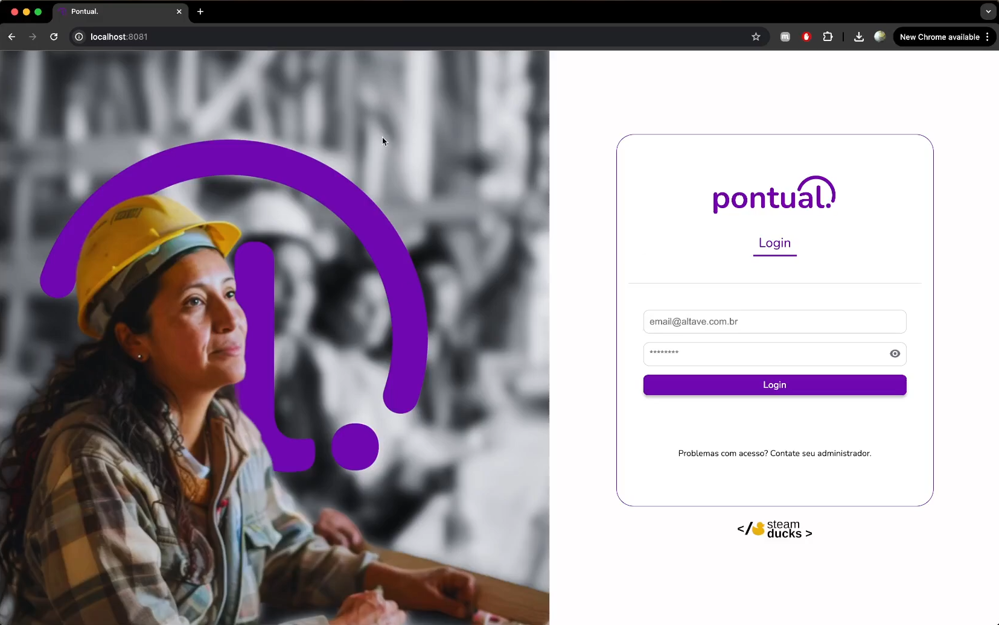
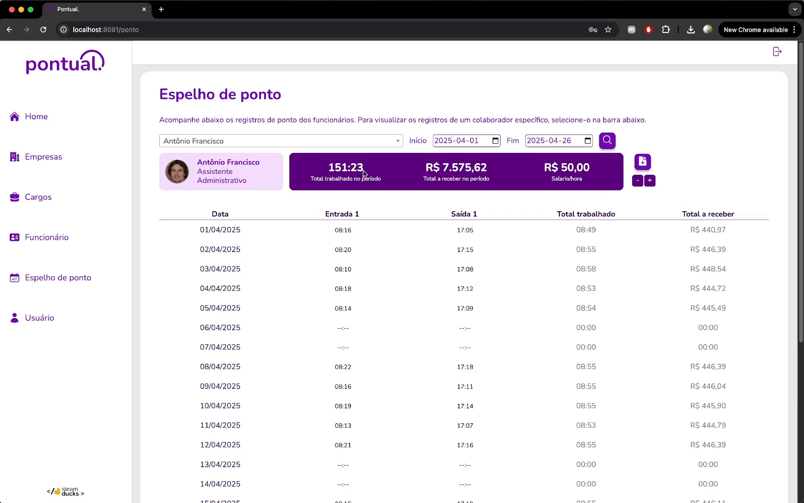
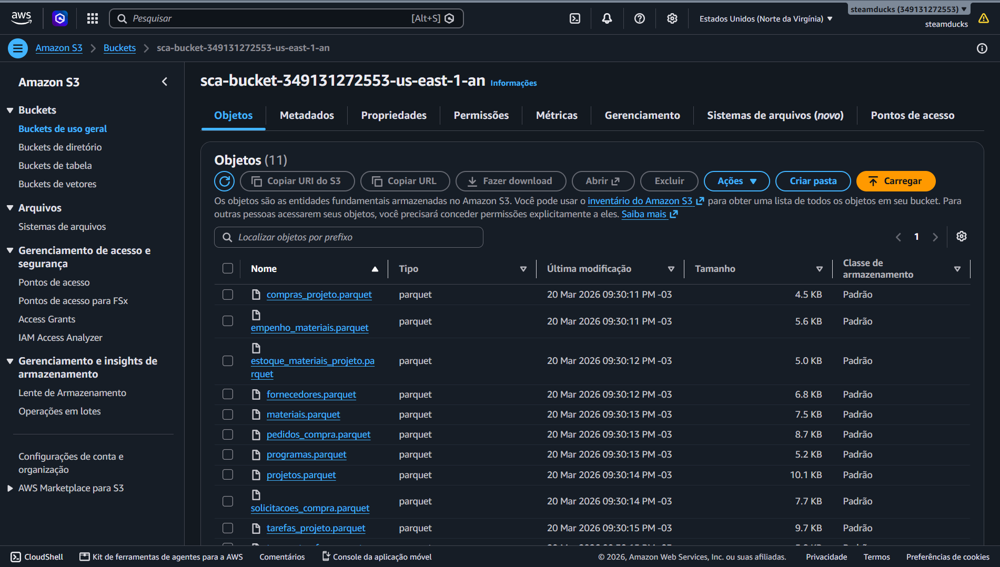
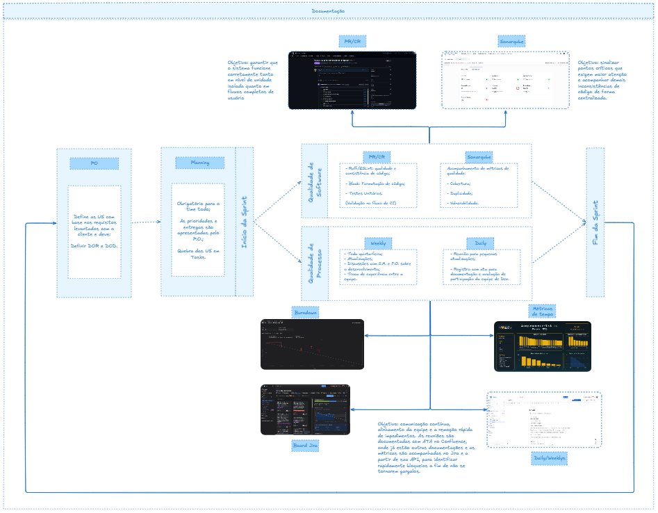

# Portfólio Banco de Dados

### Índice

- [Descrição](#descrição)
- [Visão Geral dos Projetos](#visão-geral-dos-projetos)
- [1º - Semestre 2024 - 1](#1º---semestre-2024---1)
    - [O Projeto](#o-projeto)
    - [Contribuições Individuais](#contribuições-individuais)
    - [Hard Skills](#hard-skills)
    - [Soft Skills](#soft-skills)
- [2º - Semestre 2024 - 2](#2º---semestre-2024---2)
    - [O Projeto](#o-projeto-1)
    - [Contribuições Individuais](#contribuições-individuais-1)
    - [Hard Skills](#hard-skills-1)
    - [Soft Skills](#soft-skills-1)
- [3º - Semestre 2025 - 1](#3º---semestre-2025---1)
    - [O Projeto](#o-projeto-2)
    - [Contribuições Individuais](#contribuições-individuais-2)
    - [Hard Skills](#hard-skills-2)
    - [Soft Skills](#soft-skills-2)
- [4º - Semestre 2025 - 2](#4º---semestre-2025---2)
    - [O Projeto](#o-projeto-3)
    - [Contribuições Individuais](#contribuições-individuais-3)
    - [Hard Skills](#hard-skills-3)
    - [Soft Skills](#soft-skills-3)
- [5º - Semestre 2026 - 1](#5º---semestre-2026---1)
    - [O Projeto](#o-projeto-4)
    - [Contribuições Individuais](#contribuições-individuais-4)
    - [Hard Skills](#hard-skills-4)
    - [Soft Skills](#soft-skills-4)
- [6º - Semestre 2026 - 2](#6º---semestre-2026---2)

## Descrição 

Meu nome é Felipe Reis, tenho 21 anos e sou analista de dados júnior. Atualmente trabalho com Python, SQL, PySpark e Pandas, atuando na análise, manipulação e organização de dados para gerar relatórios e soluções consistentes.

Minha trajetória na área de tecnologia começou no início de 2024, na faculdade FATEC Jessen Vidal, de São José dos Campos, e desde então venho construindo experiência em diferentes pilares do ecossistema de dados e de desenvolvimento de software. No dia a dia, é comum trabalhar com processamento distribuído, automação, pipelines e boas práticas de modelagem e armazenamento.

Nos meus planos futuros, busco me aprofundar em áreas de análise, engenharia e ciência de dados, além de evoluir continuamente em desenvolvimento de software, estudando Java, Spring Boot, Vue.js, JavaScript, e também aprimorando meus conhecimentos em programação e arquitetura de bancos de dados.

Durante o curso de Tecnologia em Banco de Dados foram desenvolvidas atividades e projetos com foco na modelagem, implementação e administração de sistemas de dados, bem como práticas relacionadas à engenharia de software, contemplando a aplicação de linguagens de programação, metodologias de desenvolvimento e a utilização de metodologias ágeis.

O decorrer do tecnólogo não se restringiu às aulas teóricas e aos laboratórios práticos, sendo orientado também pela metodologia de API (Aprendizagem por Projetos Integrados), por meio da qual foram desenvolvidos projetos aplicados a demandas reais de empresas de tecnologia. Essa abordagem possibilitou a integração entre teoria e prática, promovendo a vivência em situações que simulam o ambiente profissional, favorecendo o trabalho em equipe, a adoção de boas práticas de desenvolvimento e a busca por soluções inovadoras para problemas concretos.

Todos os projetos foram desenvolvidos com a metodologia **Scrum**, com os papéis de Product Owner, Scrum Master e Time de Desenvolvimento distribuídos entre os integrantes, sprints de três semanas e as cerimônias de planning, daily, review e retrospectiva.

## Visão Geral dos Projetos

| Semestre | Equipe | Projeto | Parceiro | Meu papel | Stack principal | Repositório |
|:---:|:---|:---|:---|:---|:---|:---:|
| 1º · 2024-1 | AlphaCode | Calculadora Científica | — | Scrum Master e Dev | TypeScript, JavaScript, HTML/CSS | [🔗](https://github.com/GustavoNMendes01/fatec-API-01) |
| 2º · 2024-2 | AlphaCode | Sistema de Avaliação PACER | — | Scrum Master e Dev | Java, JavaFX, PostgreSQL, JDBC | [🔗](https://github.com/felpzreiz/API-Sistema-de-Avaliacao-PACER) |
| 3º · 2025-1 | Steam Ducks | Pontual | Altave | Dev Front-end e Integração | Vue.js, Java/Spring Boot, Supabase | [🔗](https://github.com/Steam-Ducks/point-system) |
| 4º · 2025-2 | Steam Ducks | Trafegou | Prefeitura de SJC | Dev Full-Stack | Java/Spring Boot, Vue.js, TypeScript, Docker | [🔗](https://github.com/Steam-Ducks/traffic-monitoring-system) |
| 5º · 2026-1 | Steam Ducks | SCAR | SIATT | Dev Full-Stack (foco em Dados) | Python/Django, FastAPI, PostgreSQL, AWS S3, Vue.js, Docker | [🔗](https://github.com/Steam-Ducks/strategic-cost-analytics) [🔗](https://github.com/Steam-Ducks/sca-api) |
| 6º · 2026-2 | Steam Ducks | Akpedia | Akaer | — | — | — |

## 1º - Semestre 2024 - 1

**Equipe:** AlphaCode &nbsp;·&nbsp; **Projeto:** Calculadora Científica &nbsp;·&nbsp; **Parceiro:** projeto acadêmico, sem empresa parceira  
**Meu papel:** Scrum Master e Desenvolvedor &nbsp;·&nbsp; **Repositório:** [fatec-API-01](https://github.com/GustavoNMendes01/fatec-API-01)

### O Projeto

Primeiro projeto integrador do curso: uma calculadora científica capaz de executar, além das quatro operações básicas, cálculo fatorial, resolução de equações de 2º grau, conversão entre bases numéricas, concatenação de strings e juros simples e compostos.

O desenvolvimento aconteceu em quatro sprints. Começamos escrevendo os algoritmos em pseudocódigo no VisualG, para amadurecer a lógica sem a barreira da sintaxe, e depois reescrevemos todo o produto em TypeScript, com uma interface web em HTML e CSS.

### Contribuições Individuais

    
<b>Liderança da equipe como Scrum Master</b>
 
        

            Este foi meu primeiro contato com a metodologia ágil e, como Scrum Master, fui responsável por conduzir as cerimônias, dividir as tarefas entre oito integrantes e manter o backlog do produto e o backlog por sprint documentados no README. Boa parte dos meus commits do semestre é justamente de documentação: registrar prioridade, sprint de entrega e status de cada tarefa foi o que deu visibilidade do andamento para a equipe toda.
        

 

    
<b>Menu e operações básicas</b>
 
        

            Desenvolvi o código do menu de navegação da calculadora, que é a porta de entrada do sistema e direciona o usuário para cada operação, e implementei as operações matemáticas básicas. Foi o alicerce sobre o qual o restante do time construiu as funções mais complexas.
        

 

    
<b>Juros simples e compostos</b>
 
        

            Implementei a funcionalidade de cálculo de juros simples e compostos, traduzindo as fórmulas de matemática financeira em código e tratando os diferentes cenários de entrada (capital, taxa e período).
        

 

    
<b>Conversão de base numérica</b>
 
        

            Fui responsável pelo algoritmo de conversão entre bases numéricas, incluindo a conversão de base 8 para base 2. Também escrevi casos de teste específicos para validar números binários, garantindo que a conversão se comportasse corretamente antes da entrega da sprint.
        

 

    
<b>Migração para TypeScript e organização do repositório</b>
 
        

            Participei da reescrita dos algoritmos de pseudocódigo para TypeScript, criando a estrutura da pasta <code>typescript</code> e os arquivos de operações e de integração com a interface. Também reorganizei o repositório em pastas por operação, substituindo o arquivo único inicial por uma estrutura navegável.
        

### Aprendizados

#### <b>Hard Skills</b>

- Lógica de Programação: construção de algoritmos do zero, com condicionais, laços e tratamento de entrada.

- Pseudocódigo (VisualG): modelagem da lógica antes da implementação em linguagem real.

- TypeScript e JavaScript: reescrita do produto final em linguagem tipada, com organização em módulos.

- HTML e CSS: construção da interface web da calculadora.

- Matemática Aplicada: conversão entre bases numéricas e fórmulas de juros simples e compostos.

- Testes: criação de casos de teste para validar resultados antes da entrega.

- Git e GitHub: versionamento, organização de repositório e histórico de commits.

- Documentação Ágil: escrita e manutenção de backlog do produto e backlog por sprint.

#### <b>Soft Skills</b>

- Liderança servidora: primeira experiência conduzindo uma equipe como Scrum Master.

- Facilitação: condução das cerimônias e mediação das decisões do time.

- Planejamento: divisão e priorização de tarefas entre oito integrantes.

- Comunicação: alinhamento constante entre membros com níveis de experiência diferentes.

- Gestão de tempo: organização das entregas dentro do ciclo de cada sprint.

- Trabalho em equipe: primeiro contato com desenvolvimento colaborativo e código compartilhado.

## 2º - Semestre 2024 - 2

 

**Equipe:** AlphaCode &nbsp;·&nbsp; **Projeto:** Sistema de Avaliação PACER &nbsp;·&nbsp; **Parceiro:** projeto acadêmico, sem empresa parceira  
**Meu papel:** Scrum Master e Desenvolvedor &nbsp;·&nbsp; **Repositório:** [API-Sistema-de-Avaliacao-PACER](https://github.com/felpzreiz/API-Sistema-de-Avaliacao-PACER)

### O Projeto

Aplicação desktop para dar autonomia ao processo de avaliação por pares dentro de uma instituição de ensino. O professor cadastra os alunos, monta os grupos, define o calendário de sprints e os critérios de avaliação; os alunos, por sua vez, se autoavaliam e avaliam os colegas de equipe ao final de cada sprint. O sistema calcula a média por aluno e por critério, eliminando a digitação manual de notas e o retrabalho que ela gera.

O produto foi desenvolvido em Java, com interface gráfica em JavaFX (Scene Builder) e banco de dados PostgreSQL acessado via JDBC. A gestão do projeto foi feita no Jira e no Miro, e o repositório era meu, o que me deixou também na posição de mantenedor do fluxo de branches e Pull Requests.

### Contribuições Individuais

 
    
<b>Liderança da equipe como Scrum Master</b>
  
 
        Atuei como Scrum Master da equipe, organizando as cerimônias ágeis (daily meetings, sprint planning e retrospectivas), auxiliando na remoção de impedimentos e garantindo que o time seguisse os princípios do Scrum. Também promovi a comunicação entre os membros e o foco no cumprimento dos prazos definidos para cada sprint, além de manter a documentação do projeto — README, backlog, Definition of Ready, Definition of Done e identidade visual — sempre atualizada.
    
 

  

 
    
<b>Conexão com o Driver do PostgreSQL para JDBC</b>
 
 
        Fui responsável por trabalhar na classe que criava a conexão entre o nosso banco de dados e o código do produto em Java, garantindo que a aplicação conseguisse se comunicar de forma estável com o PostgreSQL por meio do driver JDBC. Também escrevi o script de criação do banco utilizado pela equipe.
    
 

 
  

 
    
<b>Classe DAO e camada de acesso a dados</b>
  

        Desenvolvi a classe DAO (Data Access Object), responsável por implementar as operações de CRUD (Create, Read, Update e Delete) no banco de dados, e uma classe dedicada a centralizar as operações SQL. Essa camada foi essencial para separar a lógica de acesso a dados da lógica de negócio, seguindo boas práticas de arquitetura, e passou por uma reorganização ao longo do projeto para agrupar as queries por responsabilidade.
    
 

 

 
    
<b>Importação de turmas via CSV</b>
  

        Implementei a funcionalidade que permite ao professor carregar alunos e grupos a partir de um arquivo CSV, em vez de cadastrá-los um a um. O trabalho envolveu a leitura e o parse do arquivo, a persistência dos registros no banco e o retorno de mensagens claras de sucesso ou erro, incluindo cenários de arquivo com dados incompletos ou inválidos.
    
 

 

 
    
<b>Gerenciamento de alunos e grupos</b>
  

        Desenvolvi as telas FXML e a lógica de gerenciamento de alunos e de grupos: cadastro, edição, exibição e remoção. Um ponto que exigiu atenção foi a regra que impede a exclusão de um grupo que ainda possui vínculos, evitando a perda de dados de avaliação já registrados. Também implementei o fluxo de login e a criação de senha dos usuários.
    
 

 

 
    
<b>Queries analíticas e cálculo das médias</b>
  

        Escrevi as consultas SQL que sustentam a parte analítica do sistema: contagem de alunos por grupo, atribuição de pontuação por grupo, visualização das notas por sprint e o cálculo da média final. Também precisei corrigir uma query para contornar uma restrição de chave estrangeira que bloqueava a operação, e adicionei a coluna de Status na tabela de Sprint para viabilizar a regra que bloqueia a edição de critérios após o encerramento do período.
    
 

 

 
    
<b>Fluxo de trabalho com Git</b>
  

        Mantive o fluxo de versionamento da equipe com uma branch por sprint (<code>sprint1</code> a <code>sprint4</code>) e integração à <code>main</code> por Pull Request. Isso manteve o histórico do repositório organizado por ciclo de entrega e deu à equipe um ponto de revisão antes de cada merge.
    
 

### Aprendizados

#### <b>Hard Skills</b>

- Java: implementação de classes e lógica de negócio.

- JavaFX e FXML: criação de interface gráfica com Scene Builder para interação do usuário.

- PostgreSQL: manipulação e administração de banco de dados relacional.

- JDBC: conexão entre aplicação Java e banco de dados.

- SQL Analítico: consultas com JOIN, agregações e cálculo de médias.

- DAO Pattern: implementação de CRUD com separação de responsabilidades.

- Arquitetura em Camadas: estruturação do projeto para manter organização e escalabilidade.

- Importação de Dados: leitura, parse e validação de arquivos CSV.

- Modelagem de Dados: construção do modelo DER e das restrições de integridade.

- Git Flow: branch por sprint e integração via Pull Request.

- Jira e Miro: gestão de backlog e de tarefas da equipe.

#### <b>Soft Skills</b>

- Liderança: atuação como Scrum Master, conduzindo a equipe.

- Trabalho em equipe: colaboração no desenvolvimento conjunto da aplicação.

- Comunicação eficaz: facilitação do alinhamento entre os membros do time.

- Organização: estruturação de tarefas dentro de sprints e manutenção da documentação.

- Gestão de tempo: priorização de demandas e cumprimento de prazos.

- Resolução de problemas: identificação e superação de impedimentos técnicos.

- Adaptabilidade: ajustes de planejamento conforme o andamento do projeto.

- Empatia com o usuário: atenção às rotinas de professor e aluno ao desenhar cada fluxo.

## 3º - Semestre 2025 - 1

 

 

 

**Equipe:** Steam Ducks &nbsp;·&nbsp; **Projeto:** Pontual &nbsp;·&nbsp; **Parceiro:** Altave  
**Meu papel:** Desenvolvedor Front-end, com forte atuação na integração com a API &nbsp;·&nbsp; **Repositório:** [point-system](https://github.com/Steam-Ducks/point-system)

> **Sobre a Altave:** empresa brasileira de tecnologia especializada em monitoramento inteligente por análise de vídeo com inteligência artificial, com atuação em agronegócio, energia, óleo e gás, portos, mineração e defesa.

### O Projeto

O desafio proposto pela Altave era controlar a jornada de colaboradores de empresas terceiras dentro de uma área de manutenção. O Pontual é uma aplicação web que centraliza o cadastro de empresas e profissionais, registra as marcações de ponto, permite filtrar as consultas por data, empresa e profissional, apresenta um dashboard com gráficos e possibilita a extração de relatórios para análise detalhada de cada manutenção.

O front-end foi desenvolvido em Vue.js, o back-end em Java com Spring Boot expondo uma API REST, e o banco no Supabase, baseado em PostgreSQL. O repositório principal organiza o cliente e o servidor como submódulos Git (`ps-client` e `ps-server`), e a gestão do backlog foi feita no Jira.

### Contribuições Individuais

    
<b>Identidade Visual</b>
 
        

            A identidade visual do sistema foi criada no Figma, definindo cores, tipografia e componentes reutilizáveis. Esses componentes foram implementados no Vue.js, garantindo alinhamento entre design e código e uma linguagem visual consistente entre as telas.
        

 

    
<b>Espelho de ponto e histórico de alterações</b>
 
        

            Minha entrega mais relevante do semestre. Desenvolvi as telas dinâmicas do espelho de ponto, permitindo que os gestores visualizassem os registros de cada colaborador com filtros por funcionário e intervalo de datas. Junto a isso, construí o histórico de alterações em formato de linha do tempo: cada edição em um registro — horário alterado, responsável pela modificação e data — fica registrada de forma clara e rastreável. Foi um trabalho iterativo, que passou pela criação do modal de registros, pelo redesenho da tabela de histórico e pela conexão com o endpoint que serve esses dados, trazendo transparência e auditabilidade ao sistema.
        

 

    
<b>Componentes de tabela e paginação</b>
 
        

            Implementei a paginação e customizei os componentes de DataTables usados nas listagens do sistema, adequando o comportamento padrão da biblioteca à identidade visual e às necessidades de navegação do produto. Esses componentes se tornaram base para várias telas da aplicação.
        

 

    
<b>Regras de negócio e máscaras de entrada</b>
 
        

            Tratei a regra de jornada que atravessa a meia-noite, um caso que quebrava o cálculo de horas trabalhadas por assumir que entrada e saída ocorriam no mesmo dia. Também implementei a máscara monetária nos formulários de funcionário, incluindo o formulário de edição, garantindo que o valor-hora fosse digitado e persistido em formato consistente.
        

 

    
<b>Integração Front e Back</b>
 
        

            Integração com o back-end em Java, conectando o front-end aos endpoints REST do sistema, permitindo o carregamento dinâmico de dados, ordenação e formatação de informações como datas e horários, e garantindo que todas as alterações feitas na interface fossem refletidas corretamente no banco de dados.
        

### Aprendizados

#### <b>Hard Skills</b>

- Vue.js: desenvolvimento de aplicações web interativas e componentizadas.

- JavaScript: criação de interfaces dinâmicas e responsivas.

- Integração Front-end/Back-end: consumo de endpoints REST expostos por uma API em Java com Spring Boot.

- DataTables: paginação, filtros e customização de componentes de listagem.

- Máscaras e Formatação: entrada monetária e tratamento de datas e horários.

- Regras de Negócio Temporais: cálculo de jornada em turnos que atravessam a meia-noite.

- UI/UX Design Implementation: aplicação de identidade visual (cores, tipografia e componentes).

- Figma to Code: tradução de protótipos do Figma para componentes Vue.js.

- Rastreabilidade: implementação de histórico de alterações em linha do tempo.

- Supabase e PostgreSQL: consumo de dados de um banco relacional gerenciado.

- Git com Submódulos: trabalho em repositório com cliente e servidor versionados separadamente.

#### <b>Soft Skills</b>

- Comunicação eficaz: troca clara de informações durante dailies, reviews e retrospectivas.

- Gestão de tempo: organização de tarefas e cumprimento de prazos em sprints.

- Adaptabilidade: capacidade de ajustar prioridades e implementar feedbacks rapidamente.

- Resolução de problemas: atuação proativa diante de desafios técnicos e funcionais.

- Pensamento crítico: análise das demandas e do impacto das soluções no produto.

- Autonomia e proatividade: entrega de valor contínua sem necessidade de supervisão constante.

- Colaboração ágil: aplicação de práticas Scrum (planning, backlog grooming, sprint review).

- Relacionamento com o cliente: primeiro contato com uma empresa parceira real e seus requisitos.

## 4º - Semestre 2025 - 2

 

**Equipe:** Steam Ducks &nbsp;·&nbsp; **Projeto:** Trafegou &nbsp;·&nbsp; **Parceiro:** Prefeitura de São José dos Campos  
**Meu papel:** Desenvolvedor Full-Stack &nbsp;·&nbsp; **Repositório:** [traffic-monitoring-system](https://github.com/Steam-Ducks/traffic-monitoring-system)

> **Sobre a Prefeitura de São José dos Campos:** administração pública municipal de uma das maiores cidades do interior paulista. A demanda partiu da área de mobilidade urbana, que precisava acompanhar continuamente a situação do tráfego da cidade.

### O Projeto

O Trafegou é um portal de monitoramento inteligente de tráfego. O sistema processa os dados recebidos em planilhas CSV, calcula indicadores de mobilidade e atribui a cada região da cidade um nível de 1 (tráfego fluindo) a 5 (tráfego crítico), além de um índice consolidado geral. Tudo é apresentado em um dashboard georreferenciado, com mapa interativo e cards por região, e cada nota é auditável: o gestor consegue abrir o detalhamento dos indicadores que compõem a avaliação. Quando um nível crítico é atingido, o sistema dispara automaticamente um alerta vinculado a um protocolo de ação, que o gestor responde, registra as providências e encerra.

O back-end foi construído em Java com Spring Boot e o front-end em Vue.js com TypeScript, ambos containerizados com Docker e versionados como submódulos (`tms-server` e `tms-client`).

### Contribuições Individuais

    
<b>Modelagem e cálculo dos indicadores de tráfego</b>
 
        

            Trabalhei diretamente no coração analítico do produto. Implementei o cálculo da densidade de tráfego e da taxa de conformidade, criando as métricas agregadas na camada de consulta ao banco. Em seguida, expandi o modelo com novas métricas e implementei o nível geral ponderado, que combina os indicadores com pesos diferentes para produzir a nota consolidada de cada região. Também identifiquei e corrigi um erro no cálculo de um dos indicadores que distorcia a classificação.
        

 

    
<b>Strategy Pattern para os indicadores</b>
 
        

            Em vez de acumular condicionais para cada tipo de indicador, estruturei os indicadores atrás de uma interface comum aplicando o Strategy Pattern. Cada métrica passou a ser uma implementação independente, o que permitiu adicionar novos indicadores ao cálculo do nível sem alterar o código já existente — importante em um projeto em que o modelo de cálculo evoluiu a cada sprint.
        

 

    
<b>Endpoints e camadas do back-end</b>
 
        

            Desenvolvi funcionalidades atravessando toda a arquitetura em camadas do Spring Boot: nova query no repository, novo método no service e criação do controller com o DTO correspondente para expor os dados ao front-end de forma desacoplada da entidade de banco.
        

 

    
<b>Sistema de alertas</b>
 
        

            Implementei as verificações de nível que determinam o disparo dos alertas automáticos, garantindo que uma região só gere notificação quando efetivamente atinge um patamar crítico — evitando tanto alertas perdidos quanto ruído por disparos indevidos.
        

 

    
<b>Dashboard e visualização de dados</b>
 
        

            No front-end, fiz a conexão entre back-end e interface e desenvolvi a lógica dos gráficos do dashboard: velocidade média semanal, velocidade por hora e taxa de conformidade. Na sprint final, construí os utilitários de tendência e o indicador que mostra se cada métrica está melhorando ou piorando em relação ao período anterior — funcionalidade que responde diretamente à necessidade do gestor de saber se as ações tomadas surtiram efeito.
        

### Aprendizados

#### <b>Hard Skills</b>

- Java e Spring Boot: desenvolvimento em arquitetura de camadas (Controller, Service, Repository e DTO).

- Strategy Pattern: design orientado a interfaces para tornar o cálculo de indicadores extensível.

- SQL Analítico: queries com métricas agregadas e séries temporais sobre dados de tráfego.

- Modelagem de Indicadores: definição de fórmulas, pesos e thresholds de categorização.

- Regras de Alerta: disparo automático por threshold vinculado a protocolos de ação.

- Vue.js e TypeScript: desenvolvimento de front-end tipado.

- Visualização de Dados: gráficos de velocidade, conformidade e tendência período a período.

- Docker: containerização do cliente e do servidor.

- Git com Submódulos: trabalho simultâneo em dois repositórios versionados no projeto principal.

- Jira: gestão de tarefas e rastreabilidade das entregas por card.

#### <b>Soft Skills</b>

- Tradução de negócio para métrica: transformar uma necessidade da gestão pública em fórmula e indicador.

- Comunicação com cliente público: entendimento de requisitos de um parceiro com processos formais.

- Pensamento analítico: análise crítica dos resultados dos cálculos e identificação de distorções.

- Colaboração entre front e back: alinhamento de contratos de API dentro da própria equipe.

- Autonomia: condução de funcionalidades de ponta a ponta, do banco ao gráfico.

- Ownership: responsabilidade pela qualidade do que foi entregue, incluindo correção dos próprios erros.

- Adaptabilidade: evolução do modelo de cálculo a cada sprint conforme novos dados e feedbacks.

## 5º - Semestre 2026 - 1

 

**Equipe:** Steam Ducks &nbsp;·&nbsp; **Projeto:** SCAR &nbsp;·&nbsp; **Parceiro:** SIATT  
**Meu papel:** Desenvolvedor Full-Stack, com foco em Engenharia de Dados &nbsp;·&nbsp; **Repositórios:** [strategic-cost-analytics](https://github.com/Steam-Ducks/strategic-cost-analytics) e [sca-api](https://github.com/Steam-Ducks/sca-api)

> **Sobre a SIATT:** Sistemas Integrados de Alto Teor Tecnológico é uma empresa brasileira de defesa, especializada em sistemas embarcados críticos e mísseis inteligentes, responsável por iniciativas como o MANSUP, míssil antinavio de superfície desenvolvido para a Marinha do Brasil.

### O Projeto

O SCAR (Sistema de Controle e Acompanhamento de Recursos) é um Data Warehouse com uma plataforma analítica sobre ele, criado para dar visibilidade aos custos de programas estratégicos da SIATT. A solução consolida dados de materiais, horas técnicas, projetos, programas e indicadores orçamentários, permitindo análise multidimensional por tempo, programa, projeto, material, colaborador e status financeiro.

O sistema responde a perguntas como: quanto cada projeto gastou em materiais, qual o custo real consolidado por programa, como os custos evoluem ao longo do tempo, qual o desvio percentual em relação ao orçamento e quais projetos estão em risco de estouro.

A stack foi Python com Django no back-end, PostgreSQL como Data Warehouse, Vue.js com TypeScript no front-end, Docker para containerização e GitHub Actions para integração contínua. Todo o código entrou na `main` por Pull Request, com revisão da equipe.

### Contribuições Individuais

    
<b>API de simulação da fonte de dados (FastAPI + AWS S3)</b>
 
        

        
        

         
        

            Os dados da SIATT chegavam até nós como um pacote de arquivos CSV, mas o cenário que queríamos exercitar no Data Warehouse era o de ingestão a partir de uma API. Para isso construí, sozinho, o repositório <code>sca-api</code>, que passou a ser a fonte HTTP consumida pelo nosso pipeline.
        

        

            O trabalho teve duas partes. Primeiro, um notebook de migração que descompacta os CSVs originais, lê cada arquivo com <code>pandas</code>, converte para <b>Parquet</b> com compressão Snappy e envia para um bucket <b>Amazon S3</b> usando <code>boto3</code>, com tratamento de erro por arquivo e limpeza dos temporários locais. Optei por Parquet no lugar de servir o CSV cru justamente por ser um formato colunar e comprimido, mais próximo do que se encontra em um cenário analítico real.
        

        

            Depois, a API em <b>FastAPI</b> servida por Uvicorn, com três rotas: um <i>health check</i>, uma que lista os objetos disponíveis no bucket e uma que lê um Parquet específico do S3 e devolve os registros em JSON, com tratamento de exceção na resposta. As credenciais da AWS ficaram fora do código, carregadas por variáveis de ambiente.
        

 

    
<b>Extração de dados e camada bronze do Data Warehouse</b>
 
        

            Com a fonte no ar, implementei a extração de dados dessa mesma API para as tabelas de <i>staging</i> no schema <b>bronze</b> do Data Warehouse — a primeira etapa do pipeline e a fundação sobre a qual todas as camadas seguintes foram construídas. O trabalho envolveu o consumo da API, a modelagem das tabelas de staging e a carga dos dados brutos preservando a fonte original. Ter construído os dois lados me deu uma visão rara para um projeto acadêmico: a de quem produz e a de quem consome o mesmo contrato de dados.
        

 

    
<b>Auditoria e observabilidade do ETL</b>
 
        

            Minha contribuição mais densa do semestre. Criei a tabela <code>audit.execution_logs</code>, que armazena os dados de cada execução do processo de ETL — objetivo, horário de início, duração e resultado — e implementei as funções de auditoria não apenas na camada bronze, mas também na silver. Também criei o model <code>AuditLogExec</code> para que esses registros pudessem ser consumidos por um dashboard. Sem isso, uma falha silenciosa no pipeline só apareceria quando um número saísse errado no relatório final; com a auditoria, ela aparece na origem.
        

 

    
<b>Análise da evolução de custos ao longo do tempo</b>
 
        

            Construí a tabela <b>gold</b> que sustenta a análise da evolução de custos ao longo do tempo, incluindo os testes da camada gold, e em seguida implementei o endpoint que expõe esses dados para o front-end, com a configuração necessária e testes de qualidade. Essa entrega cobriu o caminho completo de uma pergunta de negócio: da modelagem dimensional ao dado disponível na tela.
        

 

    
<b>Endpoints e correções na API</b>
 
        

            Implementei o endpoint de auditoria com filtro por período, que alimenta o dashboard de acompanhamento do ETL. Também fui responsável por correções em endpoints já existentes: o filtro de data no endpoint de custos e a coluna de timestamp que impedia o endpoint consolidado de expor os dados corretamente.
        

 

    
<b>Exportação de relatórios em Excel e CSV</b>
 
        

            No front-end, implementei a exportação para Excel em todas as páginas analíticas do sistema — Dashboard, Consolidado, Horas Técnicas, Materiais e Orçamento — integrando a biblioteca <code>xlsx</code> ao projeto. Também corrigi o exportador CSV existente, que apresentava inconsistências na geração dos arquivos. É uma funcionalidade que parece simples, mas que é o que permite ao gestor levar o dado do sistema para dentro do processo decisório dele.
        

 

    
<b>Fluxo de Qualidade do projeto (DevOps)</b>
 
        

            Além das entregas de código, fui responsável pelo fluxo de <b>Qualidade de Software</b> do projeto: definir os critérios que um trabalho precisava cumprir para ser considerado pronto e garantir que eles fossem aplicados de forma consistente ao longo de todas as sprints. Desenhei o fluxo completo, do refinamento da User Story pelo P.O. até o fechamento da sprint, mapeando onde cada verificação entra.
        

        

            Do lado técnico, os pontos de controle foram: <b>Pull Request com Code Review</b> obrigatório, para garantir qualidade e consistência do código; formatação padronizada com <b>Black</b>; e <b>testes unitários</b>, tudo validado automaticamente no fluxo de CI. O objetivo era assegurar que o sistema funcionasse corretamente tanto em nível de unidade isolada quanto em fluxos completos de usuário. Na prática, cada Pull Request aberto no projeto dispara um pipeline no GitHub Actions que encadeia lint e formatação (Ruff e Black), testes unitários com relatório de cobertura, testes de integração contra um PostgreSQL real, smoke test da aplicação e teste de carga com k6 antes de liberar o merge.
        

        

            Como camada de acompanhamento, usamos o <b>SonarQube</b> para centralizar as métricas de qualidade — cobertura, duplicidade e vulnerabilidades — sinalizando os pontos críticos que exigiam maior atenção em vez de deixá-los diluídos entre os Pull Requests.
        

        

            Também participei do ramo de <b>Qualidade de Processo</b>, conduzido junto ao Scrum Master: dailies com registro em ata, weeklies às quintas-feiras para alinhamento com S.M. e P.O., e acompanhamento de burndown, board e métricas de tempo no Jira — consultadas também via API — para identificar bloqueios antes que virassem gargalos. Toda a documentação, incluindo as atas, ficou centralizada no Confluence.
        

         
        

        
        

### Aprendizados

#### <b>Hard Skills</b>

- Engenharia de Dados e ETL: construção de pipeline de extração, transformação e carga.

- Arquitetura Medalhão: organização do Data Warehouse em camadas bronze, silver e gold.

- Data Warehouse e Modelagem Dimensional: modelagem para análise multidimensional de custos.

- Python: linguagem principal do back-end e do pipeline de dados.

- Django: criação de models e de endpoints REST.

- PostgreSQL e SQL Analítico: consultas de consolidação de custos e séries temporais.

- Observabilidade de Pipeline: auditoria de execuções com registro de objetivo, início e duração.

- Testes de Qualidade de Dados: validação das camadas do Data Warehouse.

- FastAPI: construção de API REST em Python para servir os dados de origem.

- AWS S3: armazenamento de objetos em nuvem e acesso programático via boto3.

- Parquet: formato colunar com compressão Snappy para armazenamento analítico.

- pandas: conversão e manipulação dos datasets na migração para o S3.

- Integração via API: construção da fonte de dados e consumo dela no pipeline de ingestão.

- Gestão de Credenciais: segredos em variáveis de ambiente, fora do versionamento.

- Vue.js e TypeScript: desenvolvimento das telas analíticas.

- Exportação de Relatórios: geração de arquivos XLSX e CSV a partir dos dados do sistema.

- Docker e GitHub Actions: containerização e pipeline de CI com lint, testes, smoke test e teste de carga.

- Code Review: contribuição exclusivamente via Pull Request, com critérios definidos de qualidade e consistência de código.

- Testes Automatizados: testes unitários e de integração com relatório de cobertura validados no fluxo de CI.

- SonarQube: acompanhamento centralizado de cobertura, duplicidade e vulnerabilidades.

- Padronização de Código: formatação e lint com Black e Ruff.

- Jira e Confluence: acompanhamento de burndown e métricas de tempo, inclusive via API, e documentação das cerimônias.

#### <b>Soft Skills</b>

- Rigor e rastreabilidade: postura de deixar todo processo auditável, essencial em um parceiro do setor de defesa.

- Pensamento analítico: leitura crítica dos dados e das perguntas de negócio por trás de cada requisito.

- Visão de negócio: tradução de perguntas de gestão de custos em modelo de dados e indicadores.

- Colaboração em code review: escrita de descrições claras de PR e abertura a revisão dos pares.

- Autonomia: condução de entregas do pipeline à interface sem supervisão constante.

- Comunicação com parceiro de setor regulado: cuidado com contexto e sensibilidade da informação.

- Atenção ao detalhe: identificação e correção de erros sutis, como colunas de timestamp e filtros de data.

- Iniciativa: construção da fonte de dados em API em vez de ler os CSVs direto, para que o pipeline fosse desenvolvido e testado contra uma ingestão HTTP de verdade.

- Zelo pela qualidade: definição e defesa de critérios objetivos de qualidade, sustentando o padrão do time ao longo de todas as sprints.

- Melhoria contínua: leitura de métricas de processo para antecipar bloqueios antes que virassem gargalos.

## 6º - Semestre 2026 - 2

> Em andamento.
